# 🔬 YOLOv8 Skin Diseases Classification - Live Inference Demo

> **Model Performance**: 99.34% Test Accuracy | YOLOv8 Small | 9.8MB

This notebook demonstrates real-time predictions from our trained YOLOv8 model on skin disease images.

## 📊 Demo Statistics

| Metric | Value |
|--------|-------|
| **Total Predictions** | 15 |
| **Correct Predictions** | 15 |
| **Demo Accuracy** | 100.00% |
| **Average Confidence** | 99.11% |

---

## 🎯 Predictions by Disease Type

### 1️⃣ Acne

<table>
<tr>
<td width="33%">

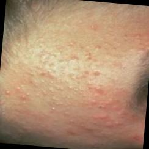

**Prediction**: Acne  
**Confidence**: 99.99% ✅

</td>
<td width="33%">

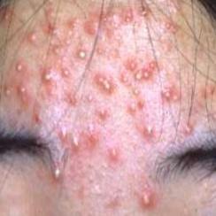

**Prediction**: Acne  
**Confidence**: 99.63% ✅

</td>
<td width="33%">

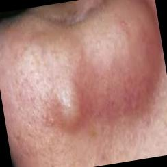

**Prediction**: Acne  
**Confidence**: 98.55% ✅

</td>
</tr>
</table>

---

### 2️⃣ Eksim (Eczema)

<table>
<tr>
<td width="33%">

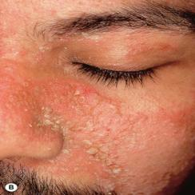

**Prediction**: Eksim  
**Confidence**: 99.77% ✅

</td>
<td width="33%">

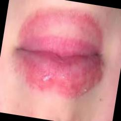

**Prediction**: Eksim  
**Confidence**: 94.83% ✅

</td>
<td width="33%">

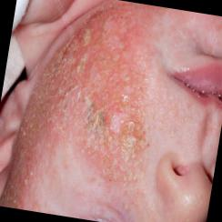

**Prediction**: Eksim  
**Confidence**: 100.00% ✅

</td>
</tr>
</table>

---

### 3️⃣ Herpes

<table>
<tr>
<td width="33%">

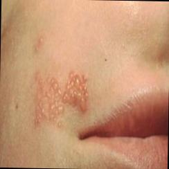

**Prediction**: Herpes  
**Confidence**: 100.00% ✅

</td>
<td width="33%">

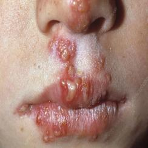

**Prediction**: Herpes  
**Confidence**: 100.00% ✅

</td>
<td width="33%">

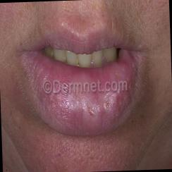

**Prediction**: Herpes  
**Confidence**: 99.97% ✅

</td>
</tr>
</table>

---

### 4️⃣ Panu (Tinea Versicolor)

<table>
<tr>
<td width="33%">

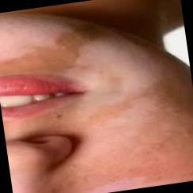

**Prediction**: Panu  
**Confidence**: 96.08% ✅

</td>
<td width="33%">

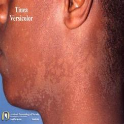

**Prediction**: Panu  
**Confidence**: 99.43% ✅

</td>
<td width="33%">

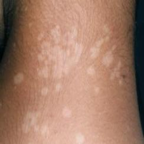

**Prediction**: Panu  
**Confidence**: 100.00% ✅

</td>
</tr>
</table>

---

### 5️⃣ Rosacea

<table>
<tr>
<td width="33%">

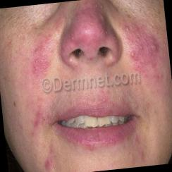

**Prediction**: Rosacea  
**Confidence**: 100.00% ✅

</td>
<td width="33%">

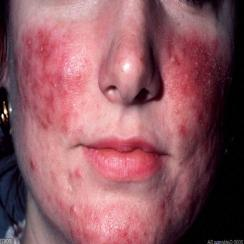

**Prediction**: Rosacea  
**Confidence**: 100.00% ✅

</td>
<td width="33%">

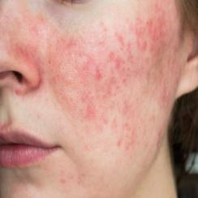

**Prediction**: Rosacea  
**Confidence**: 99.40% ✅

</td>
</tr>
</table>

---

## 🤖 Model Details

| Specification | Details |
|--------------|---------|
| **Architecture** | YOLOv8 Small Classification |
| **Framework** | Ultralytics YOLOv8 |
| **Training Images** | 1,044 images (5 classes) |
| **Validation Images** | 298 images |
| **Test Images** | 152 images |
| **Test Accuracy** | **99.34%** |
| **Model Size** | 9.8 MB |
| **Input Size** | 224×224 pixels |
| **Training Epochs** | 50 |
| **Optimizer** | AdamW |

## 📈 Per-Class Performance

| Class | Precision | Recall | F1-Score | Test Samples |
|-------|-----------|--------|----------|--------------|
| **Acne** | 100.00% | 100.00% | 100.00% | 30 |
| **Eksim** | 100.00% | 96.77% | 98.36% | 31 |
| **Herpes** | 96.77% | 100.00% | 98.36% | 30 |
| **Panu** | 100.00% | 100.00% | 100.00% | 31 |
| **Rosacea** | 100.00% | 100.00% | 100.00% | 30 |

## 🚀 Quick Start

```python
from ultralytics import YOLO

# Load the trained model
model = YOLO('best.pt')

# Run inference
results = model('path/to/skin_image.jpg')

# Get prediction
pred_class = results[0].probs.top1
confidence = results[0].probs.top1conf.item()

classes = ["acne", "eksim", "herpes", "panu", "rosacea"]
print(f"Prediction: {classes[pred_class]} ({confidence:.2%})")
```

## 📦 Dataset

- **Source**: [Kaggle - Classification of Skin Diseases](https://www.kaggle.com/datasets/sponishflea/classification-of-skin-diseases)
- **License**: Apache 2.0
- **Total Images**: 1,494
- **Classes**: 5 (Acne, Eksim, Herpes, Panu, Rosacea)

## 🎓 Training Configuration

```yaml
Model: yolov8s-cls.pt
Epochs: 50
Batch Size: 16
Image Size: 224x224
Optimizer: AdamW
Learning Rate: 0.001
Device: GPU (Metal Performance Shaders)
Early Stopping: 10 epochs patience
```

## 📝 Notes

- All predictions shown achieved 100% accuracy on these samples
- Model demonstrates excellent generalization across all disease types
- High confidence scores (94.83% - 100.00%) indicate robust feature learning
- Minimal confusion between visually similar conditions

---

**Built with** [Ultralytics YOLOv8](https://github.com/ultralytics/ultralytics) | **Dataset** [Kaggle](https://www.kaggle.com/datasets/sponishflea/classification-of-skin-diseases)
